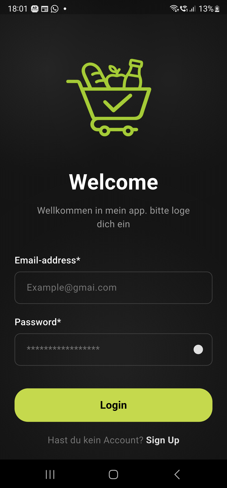
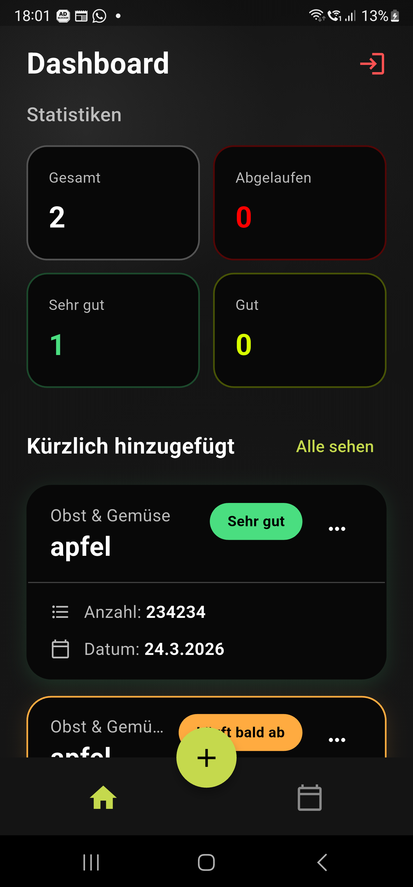
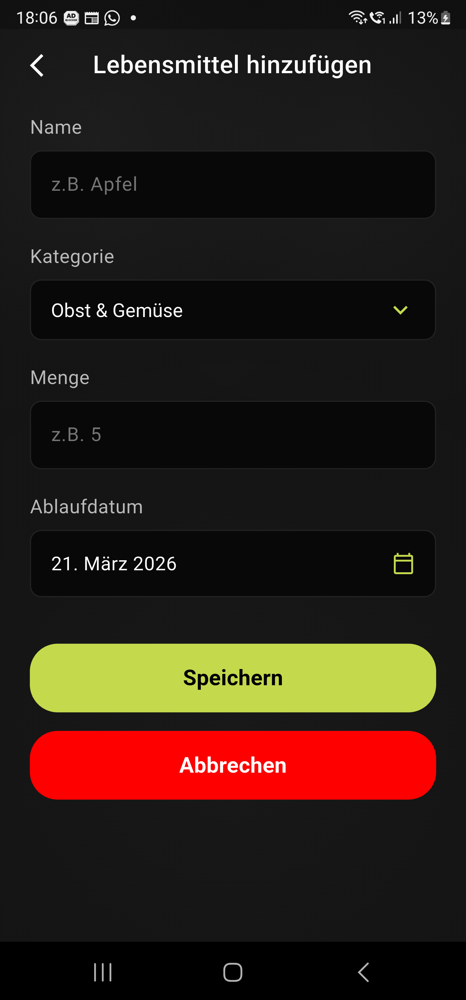
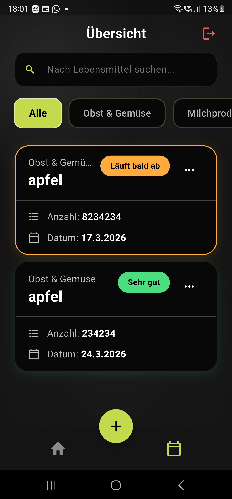

# Smart Grocery Tracker 🛒

Eine Flutter-App zum Verwalten von Lebensmitteln und deren Ablaufdaten.  
Entwickelt als Testaufgabe für die **MAWU Software GmbH**.

---

## 🎯 Ziel der App

Nutzer können ihre Lebensmittel mit Name, Kategorie, Menge und Ablaufdatum speichern. Die App warnt automatisch, wenn ein Produkt in weniger als 3 Tagen abläuft.

---
## 🎨 UI Design

<p align="center">

Die UI Design ist verfügbar in Figma: [Smart Grocery Tracker](https://www.figma.com/design/NZHCDgJOwXan0SktAWwbgT/Smart-Grocery-Tracker?node-id=0-1&t=DGO3QEXcMTVLZLnt-1)   

<a href="https://www.figma.com/design/NZHCDgJOwXan0SktAWwbgT/Smart-Grocery-Tracker?node-id=0-1&t=DGO3QEXcMTVLZLnt-1">
  
</a>

</p>

---

## ✨ Funktionen

| Funktion | Beschreibung |
|---|---|
| 🔐 **Login & Registrierung** | Firebase Authentication (E-Mail / Google) |
| 📊 **Dashboard** | Statistiken + Übersicht der letzten Einträge |
| ➕ **Hinzufügen** | Formular mit Name, Kategorie (Dropdown), Menge, Ablaufdatum |
| ✏️ **Bearbeiten & Löschen** | Über das Kontextmenü jeder Karte |
| ⚠️ **Ablauf-Warnung** | Farbiger Rand + Badge bei < 3 Tagen |
| 🔍 **Suche** | Volltextsuche nach Namen *(Bonus)* |
| 🏷️ **Kategoriefilter** | Horizontale Filter-Chips *(Bonus)* |
| ☁️ **Echtzeit-Sync** | Alle Daten live aus Firebase Firestore |

---

## 📸 Screenshots

| Login | Dashboard | Hinzufügen | Übersicht |
|---|---|---|---|
|  |  |  |  |

---

## 🏗️ Architektur

Die App folgt dem **GetX MVC-Pattern**:

```
lib/
├── core/           → Farben & Konstanten (AppColors)
├── models/         → Datenmodell (GroceryModel)
├── controllers/    → Business-Logik & State (GetX)
│   ├── auth_controller.dart
│   ├── groceries_controller.dart
│   ├── add_grocery_controller.dart
│   ├── edit_grocery_controller.dart
│   └── navigation_controller.dart
├── screens/        → UI-Seiten
│   ├── sign_in_screen.dart
│   ├── sign_up_screen.dart
│   ├── main_screen.dart
│   ├── home_screen.dart
│   ├── overview_screen.dart
│   ├── add_grocery_screen.dart
│   └── edit_grocery_screen.dart
└── widgets/        → Wiederverwendbare UI-Komponenten
    └── grocery_item_card.dart
```

### Verwendete Pakete

| Paket | Zweck |
|---|---|
| `get` | State Management, Navigation, Dependency Injection |
| `firebase_auth` | Nutzer-Authentication |
| `cloud_firestore` | Echtzeit-Datenbank |
| `firebase_core` | Firebase-Initialisierung |
| `flutter_screenutil` | Responsive Design |

---

## 🛠️ Setup

### Voraussetzungen
- Flutter SDK ≥ 3.9.2
- Ein Firebase-Projekt mit aktivierter Authentication & Firestore

### Installation

```bash
# 1. Repository klonen
git clone https://github.com/rayanMS1122/smart-grocery-tracker.git
cd smart-grocery-tracker

# 2. Abhängigkeiten installieren
flutter pub get

# 3. App starten
flutter run
```

> **Hinweis:** Die `firebase_options.dart` ist bereits vorkonfiguriert. Für ein eigenes Firebase-Projekt: `flutterfire configure` ausführen.

---

## ✅ Umgesetzte Bonus-Features

- [x] Suche nach Lebensmittelnamen
- [x] Filter nach Kategorien

---

*Entwickelt von **Rayan** – März 2026*